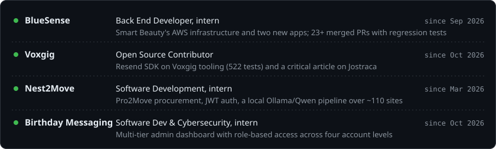
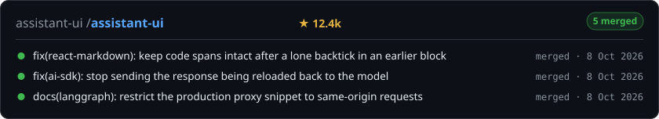
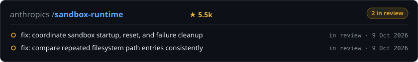
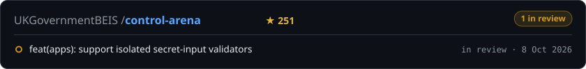
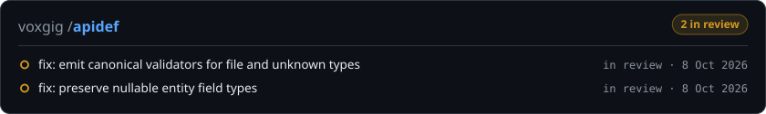

  
  
  
  

I build web, mobile and desktop software end to end: the React screen, the API, the database and the cloud it runs on.
I use LLMs as engineering tools every day, wiring agents into build, review and bug-hunting workflows, and I send the bugs
I find to the projects that own them. Final-year Computer Science student at WSB Merito University Wrocław (B.Eng., Feb 2027).

## Now

## Open source

Refreshed daily from the GitHub API. Each card opens my pull requests in that project.

<!-- OSS:START -->

<!-- OSS:END -->

## Thesis

**Automated incident response under Zero Trust: MTTR reduction in Microsoft Azure IaaS** · B.Eng., defence Feb 2027

- An SSH brute-force against a monitored host is caught by a Sentinel KQL rule and blocked by a Logic App, with no human in the loop.
- Mean Time to Respond is measured over repeated scripted trials and split into ingestion, detection and response latency.
- The whole lab is code: seven Terraform modules, one-command deploy and teardown, least-privilege identities, CI on every PR.

`Microsoft Sentinel` `KQL` `Logic Apps` `Azure Monitor` `Terraform` `NIST SP 800-207`

## Selected work

- [**computer-guardian**](https://github.com/Tunaycel/computer-guardian) · Windows storage review with SHA-256 duplicate analysis and journaled, no-overwrite quarantine.
  `Tauri` `Rust` `React`
- [**resend-voxgig-sdk**](https://github.com/Tunaycel/resend-voxgig-sdk) · TypeScript SDK generated from Resend's OpenAPI spec, 522 tests on Ubuntu and Windows CI.
  `TypeScript` `Voxgig`
- [**jostraca-critical-review**](https://github.com/Tunaycel/jostraca-critical-review) · [Critical article](https://github.com/Tunaycel/jostraca-critical-review/blob/main/article.md) on Voxgig's code generator, backed by eight executable experiments on what survives when generated code is edited by hand.
  `TypeScript` `Node.js`
- [**PlusEmlak**](https://github.com/Tunaycel/emlakplus-ai-case-study) · Real-estate CRM and AI marketing SaaS; I owned the frontend in a team of three. *Case study.*
  `Next.js 16` `React 19` `Playwright`
- [**data-stock**](https://github.com/Tunaycel/data-stock-case-study) · Inventory system; I built the campaign pricing engine and the multi-warehouse base. *Case study.*
  `FastAPI` `PostgreSQL`
- [**portfolio**](https://github.com/Tunaycel/portfolio) · My site as one scroll-driven descent through a 3D world.
  `Next.js` `React Three Fiber`

## By the numbers

<picture>
  <source media="(prefers-color-scheme: dark)" srcset="assets/metrics-dark.svg">
  
</picture>

## How I work

- **One change, one pull request,** small enough to review in one sitting.
- **Every bug fix ships with the test that would have caught it.**
- **LLMs speed me up; review and tests decide what ships.**

- **Stack** · TypeScript, Python, Rust, C# · React, Next.js, React Native · FastAPI, Node.js, PostgreSQL, Redis · AWS, Azure, Docker, GitHub Actions · Playwright, Vitest, pytest
- **Languages** · English C1 · Turkish native · Polish A2

Open to full-time roles · Wrocław on-site, hybrid or remote within the EU

