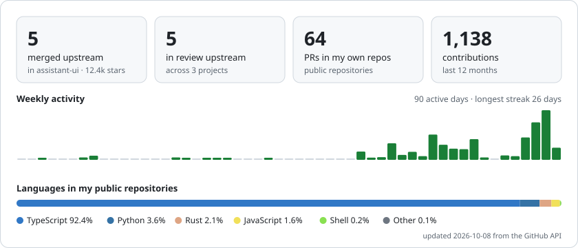

  
  
  
  

I build web, mobile and desktop software end to end, from the React screen to the API, the database and the cloud it runs on.
Since LLMs went mainstream I have also worked on them professionally: researching how they behave, orchestrating agents into real
engineering pipelines, and hunting bugs, reproducing them and fixing them upstream. Final-year Computer Science student at
WSB Merito University Wrocław (B.Eng., Feb 2027).

## Now

| Role | Where | What I ship |
|---|---|---|
| **Back End Developer** · intern | [BlueSense](https://github.com/bluesense-ai) · Boston, remote · Sep 2026 → | Building Smart Beauty's AWS infrastructure and developing two apps. Fixed auth, checkout, upload and token-renewal flows and redesigned most of the storefront: 23+ merged PRs, each with regression tests. |
| **Open Source SDK Contributor** · freelance | [Voxgig](https://github.com/voxgig) · Dublin, remote · Oct 2026 → | [Resend TypeScript SDK](https://github.com/Tunaycel/resend-voxgig-sdk) generated with Voxgig tooling: 522 passing tests on Ubuntu and Windows CI. [Jostraca review](https://github.com/Tunaycel/jostraca-critical-review) with eight executable regeneration scenarios. |
| **AI Research & Agent Orchestration** · independent | Remote · ongoing | LLM evaluation and AI control experiments ([control-arena](https://github.com/UKGovernmentBEIS/control-arena)), multi-agent pipelines for building, reviewing and bug hunting, and authorized security research. Bugs found this way go upstream as fixes ([assistant-ui](https://github.com/assistant-ui/assistant-ui), [voxgig](https://github.com/voxgig/apidef)). |
| **Software Development & Cybersecurity** · intern | Birthday Messaging for Business and Consumers · London, remote · Oct 2026 → | Multi-tier admin dashboard (Master, VAR, Agency, End User): parent-child hierarchy, role-based access, account limits. |
| **Software Development** · intern | Nest2Move · Kraków, remote · Mar 2026 → | Pro2Move procurement across five modules, JWT auth, typed API client; GPU Ollama/Qwen pipeline enriching ~110 company websites. PazarPilot Trendyol/Hepsiburada operations panel with shelf-level WMS. |

## Open-source contributions

Merged upstream work, refreshed every day from the GitHub API.

<!-- OSS:START -->
| Project | Stars | Merged PRs | Recent work |
|---|---:|---:|---|
| [**assistant-ui/assistant-ui**](https://github.com/assistant-ui/assistant-ui) | ★ 12.4k | 5 | [fix(react-markdown): keep code spans intact after a lone backtick in an earlier block](https://github.com/assistant-ui/assistant-ui/pull/9025) [fix(ai-sdk): stop sending the response being reloaded back to the model](https://github.com/assistant-ui/assistant-ui/pull/9028) [docs(langgraph): restrict the production proxy snippet to same-origin requests](https://github.com/assistant-ui/assistant-ui/pull/8980) |

**In review**

- [anthropics/sandbox-runtime](https://github.com/anthropics/sandbox-runtime): [fix: coordinate sandbox startup, reset, and failure cleanup](https://github.com/anthropics/sandbox-runtime/pull/677)
- [anthropics/sandbox-runtime](https://github.com/anthropics/sandbox-runtime): [fix: compare repeated filesystem path entries consistently](https://github.com/anthropics/sandbox-runtime/pull/676)
- [UKGovernmentBEIS/control-arena](https://github.com/UKGovernmentBEIS/control-arena): [feat(apps): support isolated secret-input validators](https://github.com/UKGovernmentBEIS/control-arena/pull/899)
- [voxgig/apidef](https://github.com/voxgig/apidef): [fix: emit canonical validators for file and unknown types](https://github.com/voxgig/apidef/pull/171)
- [voxgig/apidef](https://github.com/voxgig/apidef): [fix: preserve nullable entity field types](https://github.com/voxgig/apidef/pull/170)
<!-- OSS:END -->

## Thesis

> **Automated Incident Response under Zero Trust Architecture: MTTR Reduction in Microsoft Azure IaaS**
>
> B.Eng. Software Development · WSB Merito University Wrocław · defence Feb 2027

A controlled Azure lab where the attack, the telemetry and the response are all code, so every trial starts from the same baseline.

| | |
|---|---|
| **Question** | How much of the gap between an attack (seconds) and a human analyst (minutes to hours) can automated response close? |
| **Pipeline** | A monitored Ubuntu host ships SSH auth logs through Azure Monitor Agent to Log Analytics. A Sentinel KQL rule flags a burst of failed logins from one source and raises an incident. A Logic App playbook blocks that address at the network layer, with no human in the loop. |
| **Measured** | Mean Time to Respond across repeated scripted brute-force trials, split into ingestion, detection and response latency. |
| **Engineering** | Seven Terraform modules, one-command deploy and teardown, least-privilege identities, budget caps, architecture decision records, CI checks on every PR. |
| **Stack** | Microsoft Sentinel · KQL · Logic Apps · Azure Monitor · Terraform · Zero Trust (NIST SP 800-207) |

## Selected projects

| Project | What it is | Stack |
|---|---|---|
| [**computer-guardian**](https://github.com/Tunaycel/computer-guardian) | Privacy-first Windows storage review: bounded scanning, SHA-256 duplicate analysis, journaled quarantine with no-overwrite restore. Rust and Playwright tests. | Tauri · Rust · React · TypeScript |
| [**resend-voxgig-sdk**](https://github.com/Tunaycel/resend-voxgig-sdk) | Unofficial Resend SDK generated with Voxgig, with a reproducible test suite and an evaluation of the generator. | TypeScript · Voxgig · GitHub Actions |
| [**jostraca-critical-review**](https://github.com/Tunaycel/jostraca-critical-review) | Technical review of the Jostraca code generator, with eight executable experiments on merge behaviour and semantic correctness. | TypeScript · Node.js |
| [**PlusEmlak**](https://github.com/Tunaycel/emlakplus-ai-case-study) · case study | Real-estate CRM and AI marketing SaaS. Frontend owner in a team of three: CRM, dashboards, typed API client, AI template editor. | Next.js 16 · React 19 · Playwright |
| [**data-stock**](https://github.com/Tunaycel/data-stock-case-study) · case study | Scan-based inventory system. Date-windowed campaign rules, deterministic overlap resolution, multi-warehouse foundation with audit history. | FastAPI · PostgreSQL |
| [**portfolio**](https://github.com/Tunaycel/portfolio) | My site as one scroll-driven descent through a persistent 3D world. | Next.js 14 · React Three Fiber |
| [**globallife**](https://github.com/Tunaycel/globallife) | Relocation platform front-end: visa and language dashboards, Google OAuth, 4-locale i18n. | Next.js 16 · React 19 · three.js |

Case studies describe private team codebases.

## Engineering metrics

<picture>
  <source media="(prefers-color-scheme: dark)" srcset="assets/metrics-dark.svg">
  
</picture>

<picture>
  <source media="(prefers-color-scheme: dark)" srcset="https://raw.githubusercontent.com/Tunaycel/Tunaycel/output/snake-dark.svg">
  
</picture>

## How I work

- **One change, one pull request.** Small diffs that can be reviewed in one sitting, with the reason in the description.
- **A bug fix comes with the test that would have caught it.** Regression tests first, then the fix.
- **Prove it runs.** CI on more than one OS where it matters, and I open the screen I changed before I call it done.
- **AI as a tool, not an author.** I use LLMs for implementation, debugging and research, and every output goes through review and tests.

## Toolbox

  
   
  
   
  
   
  

- **Security** · Azure Sentinel, Logic Apps, KQL, Zero Trust, SIEM / SOAR, authorized bug hunting
- **AI** · LLM evaluation, AI control, agent orchestration, Claude, Gemini, Ollama / Qwen, structured extraction
- **Languages** · English C1 · Turkish native · Polish A2

Available for full-time roles · Wrocław on-site, hybrid or remote within the EU

